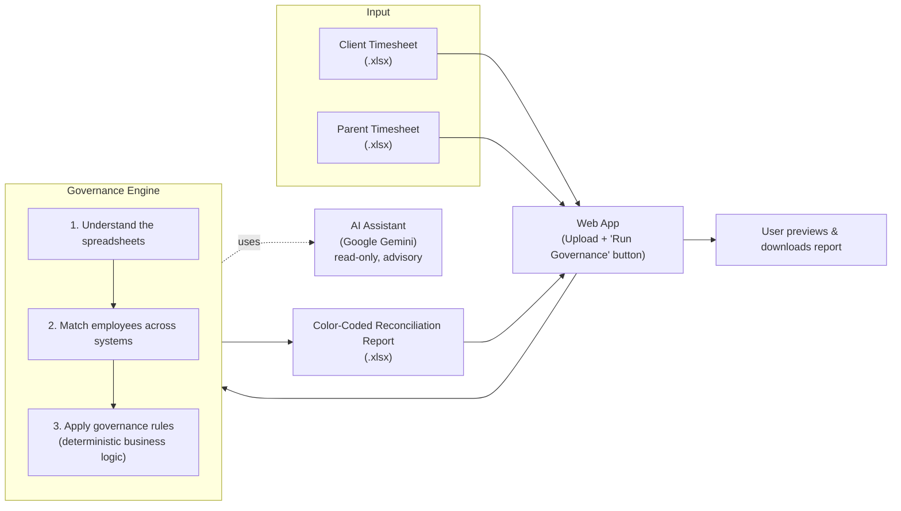
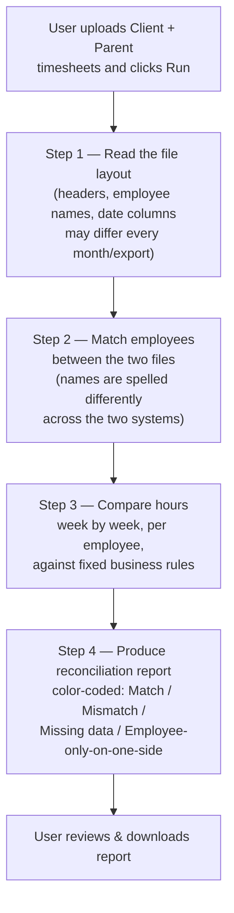

# Timesheet Governance — Architecture & Flow Overview

*A leadership-level summary of what the system does, how it's built, and where automation (AI) is and isn't involved in the final decision.*

---

## 1. The problem this solves

Every reporting period, hours reported by our own workforce (the **Parent** timesheet) need to be reconciled against hours the **Client** invoices us for. Today that reconciliation — matching employees across two systems that spell names differently, then comparing hours week by week — is manual, slow, and error-prone.

This system automates that reconciliation end-to-end: upload the two spreadsheets, click one button, get back a color-coded report showing exactly where hours match, where they don't, and who's missing from either side.

---

## 2. System at a glance

**Three moving parts:**
- **Web App** — a simple internal tool. Upload two files, click one button.
- **Governance Engine** — the business logic that actually performs the reconciliation.
- **AI Assistant** — used only in two *supporting* steps (explained in §4), never to make the financial match/mismatch call itself.

---

## 3. End-to-end flow

Every run processes the **entire** reconciliation — there isn't currently a way to re-run just one employee or one section; it's a single, repeatable pipeline that takes both files in and produces one finished report out.

---

## 4. Where AI is used — and where it deliberately isn't

This is the most important governance point for leadership: **AI never decides whether hours match.** It's used only to remove manual, repetitive prep work, and every AI output is checked before being trusted.

| Step | What AI (Gemini) does | What AI does *not* do | Safety net if AI is wrong |
|---|---|---|---|
| **Understand file layout** | Looks at the top of each spreadsheet and identifies which column has employee names, which columns are dates, etc. — because the exact layout varies month to month. | Does not touch or interpret any hours/financial data at this stage. | Result is checked against the actual file before use; if a named column doesn't exist, the system falls back to well-known column-name patterns instead of trusting AI blindly. |
| **Match employee identities** | Matches "J. Smith" in one file to "Smith, John" in the other, since the two systems don't share a common employee ID. | Does not see or use any hours, rates, or amounts — only name lists. | Clear matches are accepted; uncertain matches are logged and auto-resolved to the most likely candidate so the pipeline doesn't stall; anyone can review the mapping file afterward. |
| **Compare hours & decide Match/Mismatch** | **Not involved.** | — | This is 100% fixed, auditable business logic — the same rule runs the same way every time, with no AI involvement. |

This separation matters for **audit and trust**: the actual financial reconciliation decision is deterministic code, not a model's judgment call. AI is confined to the "data janitor" work of reading messy, inconsistently-formatted inputs.

---

## 5. The governance decision (business rules)

For every employee, every week, the system compares:
- **Hours the Parent company recorded** (Mon–Fri) — labeled **ASPIRE**
- **Hours the Client is invoicing for** — labeled **FG**

| Client's Timesheet Status | Rule | Result |
|---|---|---|
| **Invoiced** | Compare Parent hours vs. Client hours | Match → 🟩 **Green** &nbsp;&nbsp; Mismatch → 🟥 **Red** |
| Anything else (Pending, Submitted, Draft, etc.) | Hours are **never** compared — status alone is enough to flag it | Always → 🟥 **Red** |
| Employee exists in Client file but not in Parent file | Can't reconcile — no record to compare against | 🟨 **Yellow** |
| Employee exists in Parent file but not in Client file | Included in report for visibility | 🟦 **Blue** |

This color coding is what leadership and finance actually see in the final report — a quick visual audit trail of exactly where risk sits.

---

## 6. Business value

- **Speed:** A reconciliation that used to take manual cross-referencing now completes in the time it takes to run one automated pipeline.
- **Consistency:** The same rule set is applied identically every single time — no variation between who's doing the reconciliation that week.
- **Auditability:** Every mismatch is traceable to a specific rule (status, hours delta, or missing record), not a subjective judgment call.
- **Adaptability:** Because file-layout detection is automated, the tool tolerates minor formatting changes in either company's monthly export without needing a code change each time.

---

## 7. Current limitations & things to watch

- **External dependency:** The layout-detection and employee-matching steps call an external AI service (Google Gemini). If that service is unavailable, those two steps can't run until it's back up (the core hours-comparison logic has no such dependency).
- **Single full-pipeline run:** There's currently no way to re-run just a subset (e.g., one employee or one week) — every click reprocesses everything.
- **Uncertain employee matches are auto-resolved, not blocked:** To keep the tool from stalling on ambiguous name matches, it currently picks the most likely candidate automatically rather than pausing for a human decision. This is logged for review but is worth knowing about as a control point.
- **No built-in user access control yet:** Today it's a straightforward internal tool — anyone with access to the app can upload files and run the full reconciliation.

---

## 8. Possible next steps (for discussion)

- Add a review/approval step for "uncertain" employee-name matches before they're auto-resolved.
- Add the ability to re-run a single employee or week without reprocessing the whole file.
- Add user-level access logging for audit purposes.
